# `agent_v2` — Architecture Deep Dive

A long-form companion to the [README](README.md). The README tells you
*how to run it*. This document tells you *why it's shaped this way*,
what we'd do differently, and what the cost / accuracy trade-offs are.

---

## 0. TL;DR

We built a multi-agent shopping assistant that:

- Routes user turns through a **bounded supervisor loop** (max 4
  iterations) backed by an LLM classifier with conversation history.
- Runs domain work inside **`create_agent` sub-agents** with
  middleware (skills, HITL, tool-call logging).
- Carries a **typed Pydantic cart** as the source of truth for
  invariants ("you can't confirm without a fresh shipping quote").
- Surfaces a **single writer agent** as the one voice that talks to
  the user — sub-agents return structured `StepResult`s, not text.
- Persists cross-session state to a swappable **`BaseStore`**.

The whole thing is a hybrid: **`Command(goto=…)` deterministic
routing on the outside** (where invariants live), **`create_agent`
LLM-driven agents on the inside** (where conversation lives).

Why that hybrid? Because the LLM-driven primitives are great at
loose conversational flow but terrible at typed gates. The
deterministic primitives are the opposite. Each layer plays to its
strength.

---

## 1. The problem we're solving

A real e-commerce assistant has to do four things well at once:

1. **Browse intent**: find products, answer "do you ship to X".
2. **Checkout intent**: walk a user through identity → address →
   delivery → payment, with strict invariants ("must have a fresh
   tax quote for the current zip before charging").
3. **Post-purchase intent**: track an order, list past orders.
4. **Pivot mid-flow**: the user starts checking out, then asks "wait,
   do you sell hats too?" — the system has to escape checkout
   without losing the cart state.

The LLM is great at the first three when the framing is right. It
gets dangerous when **invariants** get involved. You don't want a
model that can talk its way past "no shipping quote on file" because
its training data thinks that sounds friendly.

The architectural goal: **let the LLM drive the conversation, let
typed code enforce the invariants.**

---

## 2. The big picture

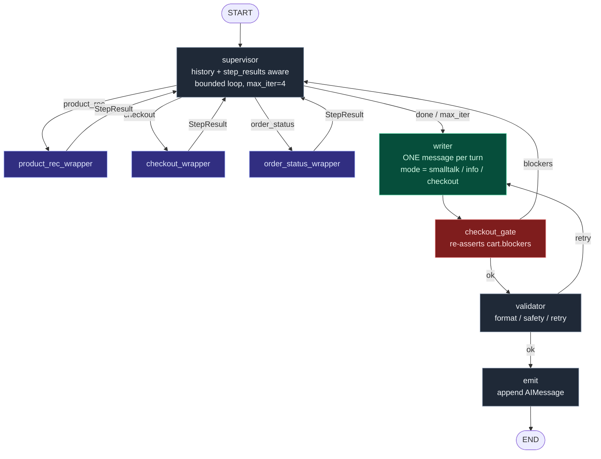

Three layers:

| Layer | What it is | Where it lives | What it's good at |
|---|---|---|---|
| **Outer graph** | A LangGraph `StateGraph` with `Command(goto=…)` routing and a Pydantic state schema. | `graph.py`, `state.py` | Deterministic routing, invariant gates, retry budgets. |
| **Sub-agents** | `langchain.agents.create_agent` instances with middleware. | `sops/checkout.py`, `sops/product_rec.py`, `sops/order_status.py` | LLM + tool calling, skill loading, HITL interrupts. |
| **Domain model** | Pure-Python Pydantic models + services. | `checkout/` package | Invariants, computed properties, mutation policy. |

The split is **load-bearing**: the outer graph never calls the LLM
"freely". It either routes via deterministic logic, gates on typed
state, or invokes a sub-agent (which is the only place the LLM
actually runs).

---

## 3. State: typed where it has to be, TypedDict where the framework demands

LangChain 1.0 made an annoying constraint: **`create_agent`'s state
schema must be a `TypedDict`** extending its built-in `AgentState`.
Pydantic models are no longer accepted there.

We use Pydantic anyway — at the **outer** layer.

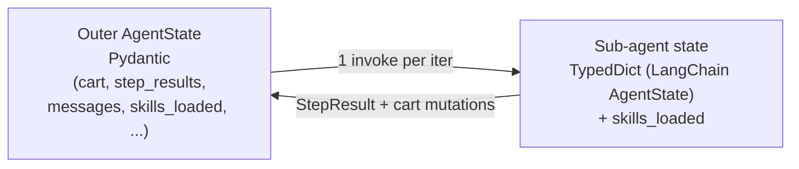

Why both?

- **Pydantic outer** gives us `Cart.blockers()` as a method, computed
  properties like `Cart.grand_total`, type-checked enums, and full
  IDE autocomplete in tests. The cart's invariants are LITERALLY
  code, not prompt instructions.
- **TypedDict inner** is what `create_agent` requires. We only
  *extend* the default with `skills_loaded` — no business logic.
- Cross-layer state flows through:
  - **`RuntimeContext`** (a `@dataclass` passed via
    `agent.invoke(..., context=…)`): carries the live `CartService`
    so tools can mutate the cart.
  - **`StepResult`** (a Pydantic model in `step_result.py`): each
    wrapper returns one to summarize what its sub-agent did.

This keeps the LLM-facing layer simple (a TypedDict + a few tool
schemas) while the invariants live in real Python.

---

## 4. The Cart — a deliberately strict source of truth

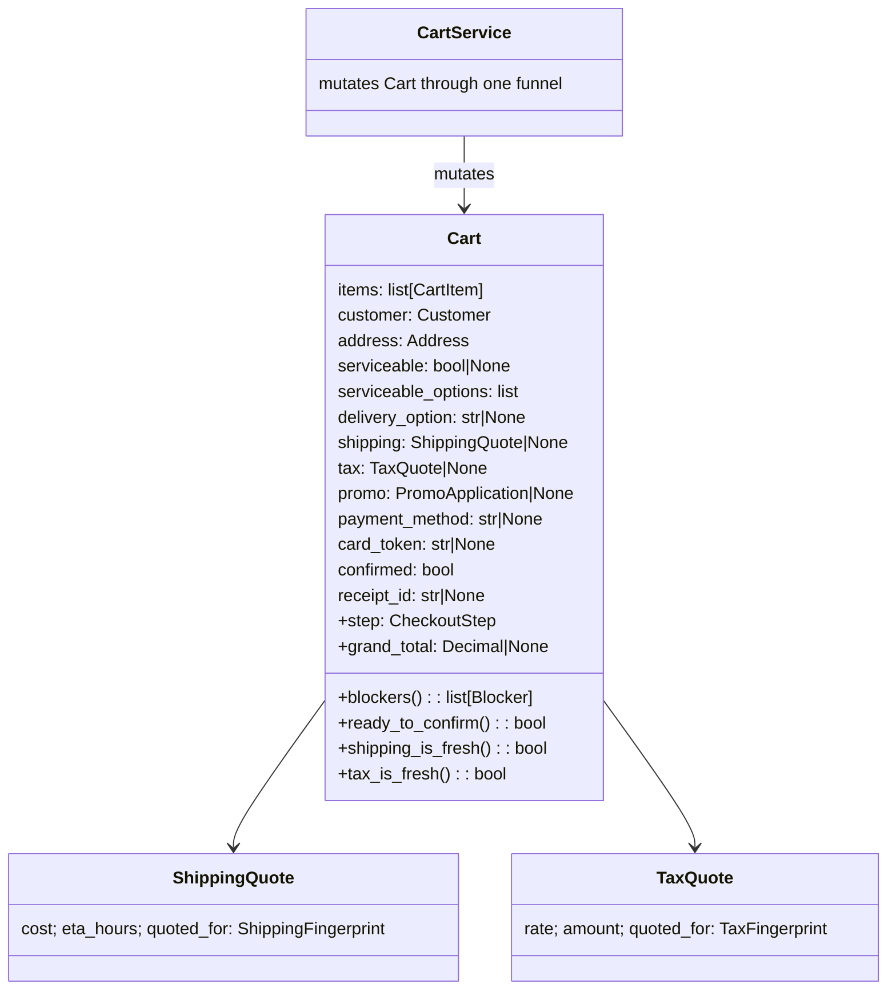

Three design choices stand out:

### 4a. `Cart.step` is a derived property, not a stored field

```python
@property
def step(self) -> CheckoutStep:
    if not self.items: return COLLECTING_PRODUCTS
    if not self.customer.is_complete(): return COLLECTING_IDENTITY
    if not self.address.is_complete(): return COLLECTING_ADDRESS
    if self.serviceable is None: return AWAITING_SERVICEABILITY
    ...
```

You can't end up in an "impossible" step because the step IS the
state. No drift between "step = collecting_address" and "address
already filled". This is more or less the **state-machine-as-derived-
property** pattern.

### 4b. Quotes carry the fingerprint of their inputs

```python
class ShippingFingerprint(BaseModel):
    items_signature: str       # sha1 of sorted (sku, qty)
    zip_code: str | None
    delivery_option: str | None

class ShippingQuote(BaseModel):
    cost: Decimal
    eta_hours: int
    quoted_for: ShippingFingerprint   # ← provenance

def shipping_is_fresh(self) -> bool:
    return self.shipping.quoted_for == self.shipping_fingerprint()
```

When anything in the fingerprint changes (items, zip, delivery
option), `shipping_is_fresh()` becomes False — automatically — and
`Cart.blockers()` lists `stale_shipping`. No manual "set this dirty
flag" anywhere.

Tax has its own fingerprint (items + zip, no delivery option),
because tax doesn't depend on shipping. **Different inputs ⇒
different fingerprint type.** This is a small thing that took
solving twice to get right (v3 had one shared fingerprint; v4 split
them because changing delivery option was needlessly invalidating
tax).

### 4c. All mutations funnel through `CartService`

Tools don't mutate `Cart` directly — they call `CartService.add_item(...)`
or `set_address(...)`. The service is the **one place invalidation
policy lives**:

```python
def set_shipping_address(self, ...):
    if self.cart.zip_code != zip_code:
        self.cart.shipping = None       # invalidate
        self.cart.tax = None
        self.cart.serviceable = None
        self.cart.serviceable_options = []
        self.cart.delivery_option = None
    ...
```

If you change this policy, you change it once. The tool layer never
has to know that changing zip invalidates serviceability + delivery
+ shipping + tax.

### Trade-off

The cart model is genuinely heavy — ~400 LOC for a "real" feeling
shopping cart. Worth it because **invariant enforcement is now
typed and testable**:

```python
def test_payment_switch_clears_token():
    s = CartService()
    s.add_item("P-1")
    s.attach_payment("card", card_token="tok_x")
    assert s.cart.card_token == "tok_x"
    s.attach_payment("cash")
    assert s.cart.card_token is None    # invalidation happened
```

These tests run in ~0.001s each, with no LLM, no network, no
mocking. That's the prize.

---

## 5. Skills + constrained tools (progressive disclosure)

Inside the checkout sub-agent we use LangChain's **skills pattern**.

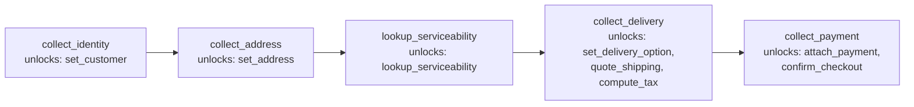

Two pieces of machinery:

- **`SkillsMiddleware`** (`middleware/skills.py`):
  - On `before_model`, appends an "Available skills:" block to the
    conversation as a SystemMessage. The model sees one-line
    descriptions of every skill PLUS a "(loaded)" marker for ones
    already loaded.
  - Registers the `load_skill` tool (via the middleware's `tools=[]`
    attribute) which returns a `Command(update={"skills_loaded":
    [name], "messages": [ToolMessage(content=skill_content, ...)]})`.
- **Constrained tools** (`tools/checkout_tools.py`):
  - Every tool that should be skill-gated reads
    `runtime.state["skills_loaded"]` and returns an error string if
    its required skill isn't loaded:
    ```python
    @tool
    def set_address(..., runtime: ToolRuntime[RuntimeContext] = None) -> str:
        err = _require_skill(runtime, "collect_address")
        if err:
            return err
        return runtime.context.cart_service.set_address(...)
    ```
  - The error is a *string*, not an exception — the model sees it
    and recovers naturally ("I should load that skill first").

### Why this beats stuffing the whole flow into one giant prompt

- The system prompt stays short. The agent has 5 one-line skill
  descriptions, not 5 paragraphs of detail.
- Each skill's *full* content (the multi-step instructions) is only
  injected when the agent loads it. Smaller prompts = cheaper +
  faster.
- The model literally CANNOT skip ahead — even if it tries to call
  `set_address` before loading `collect_address`, the tool refuses.

### One subtle gotcha (the `InjectedToolCallId` story)

When a tool returns a `Command` that includes a `ToolMessage`, the
`tool_call_id` on that message MUST match the AIMessage's tool_call
id, or LangChain's ToolNode raises a validation error. Our first
implementation declared `tool_call_id: str` as a regular parameter
— the model invented its own value (`'load_identity_1'`), the ids
didn't match, the conversation deadlocked.

Fix: `tool_call_id: Annotated[str, InjectedToolCallId]` — removes
the param from the model-visible schema, injects the real id at
runtime. We have a regression test for it.

---

## 6. The supervisor as a bounded loop, not a one-shot

The v3 supervisor was a one-shot classify + route. That broke on
compound asks ("add the green cap and pay" needs two SOPs).

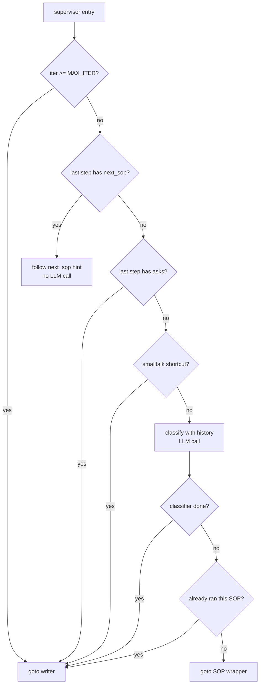

The classifier is one OpenAI structured-output call:

```python
class SupervisorDecision(BaseModel):
    done: bool
    next_sop: SOPName | None
    reason: str = ""
```

And it gets passed: the last 8 conversation turns, the structured
step results from THIS turn, and the current `cart.step`. So it can
distinguish:

- "94110" with no prior context → smalltalk (writer asks the user
  what they want)
- "94110" right after the agent asked "what's your zip?" → checkout

### Short-circuits that save LLM calls

Five paths skip the classifier entirely:

| Path | Saves |
|---|---|
| `iteration >= MAX_ITERATIONS=4` | 1 classifier call |
| Previous step gave a `next_sop` hint | 1 classifier call per hop |
| Previous step has `asks` (user must respond) | 1 classifier call |
| Smalltalk keyword match (`hi`, `thanks`, …) | 1 classifier call |
| Classifier picks an already-run SOP | 1 wasted SOP invocation |

Together these turn most turns into **one LLM call** (the writer)
instead of three (classifier + sub-agent + writer). Smalltalk turns
take ~500ms; compound asks take ~3-4s.

### What's brittle here

- The smalltalk keyword list (`_SMALLTALK_KEYWORDS`) is hand-tuned.
  A more elegant approach: train a tiny classifier (or distill from
  the bigger one). Production move.
- The "already ran this SOP" guard assumes the SOP is idempotent
  within a turn. If a SOP needs to be called twice in one turn for
  legit reasons, this breaks. Not a problem today, but it's a
  policy choice worth noting.

---

## 7. The writer — the single voice

Before v4, each sub-agent produced its own user-facing text. That
meant three different tones, three places to enforce safety, and
plenty of opportunity for one agent to talk about checkout while
another talks about products. Bad UX.

In v4 the wrappers return **structured `StepResult`s** with no
user-facing text. A single **writer node** at the end of every turn
composes ONE reply from:

- the user's original message
- every `StepResult` accumulated this turn (with `.details`
  containing the actual data: products, order info, serviceability
  results)
- the current cart snapshot (only when the mode is `checkout`)

The writer picks its **mode** programmatically:

```python
def _pick_mode(state) -> WriterMode:
    sops = {r.sop for r in state.step_results}
    if SOPName.CHECKOUT in sops: return "checkout"
    if sops: return "info"
    return "smalltalk"
```

And the prompt is strict about mode behavior. Critically:

> **mode = "smalltalk"** — DO NOT mention the cart, items, checkout,
> addresses, payment, or anything shop-related unless the user
> explicitly asked.

This was a real bug — the writer was greeting users by listing
their missing checkout fields. The mode mechanism + payload-shape
discipline (cart only goes into the payload when relevant) fixes
it. There's a regression test (`test_smalltalk_payload_has_no_cart`)
to keep it that way.

### Why the writer isn't a `create_agent`

It has no tools — pure compose-from-payload. A `create_agent` would
add overhead (agent loop, tool-call planning) we don't need. One
`ChatOpenAI.invoke(...)` is enough.

### What the writer costs

One model call per turn, configurable via `AGENT_V2_WRITER_MODEL`
(falls back to the main model). In production you'd use a cheaper
model here — `gpt-4o-mini` quality is enough for the compose-from-
JSON job. Probably ~30% of the per-turn LLM cost, depending on
sub-agent count.

---

## 8. The gate: defense in depth

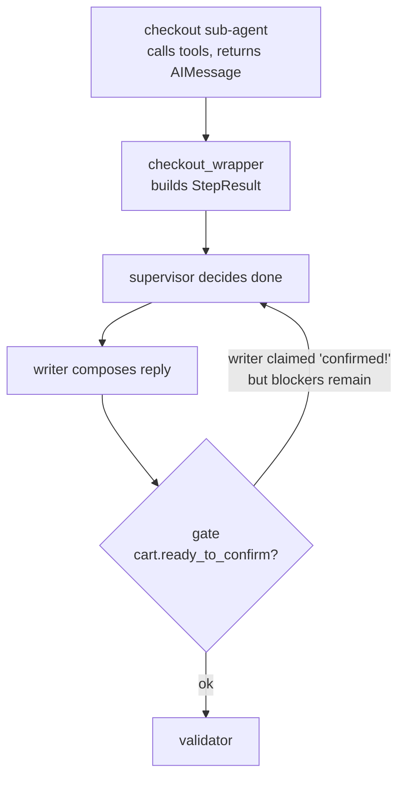

`checkout_gate` runs AFTER the writer, when `active_sop=checkout`.
It text-matches the draft for "confirmed", "placed", "all set" etc.
and cross-checks against `cart.ready_to_confirm()`. If the writer
hallucinated a confirmation but the cart has blockers, the gate
loops the turn back to supervisor with a `gate` validation error and
an incremented `response_attempts` counter.

This is **defense in depth**: skill ladder + constrained tools are
the first line of defense; the gate is the second. They check the
same `Cart.blockers()` — the gate just catches the case where the
model's *natural-language output* contradicts the actual state.

In a real system you might also want a **third line** that no LLM
can bypass: a final pre-charge service call that validates the cart
against your billing system independently. We don't have one here
because there's no real billing system, but the architectural slot
exists.

---

## 9. Confirmation — prompt-gated, not middleware-gated

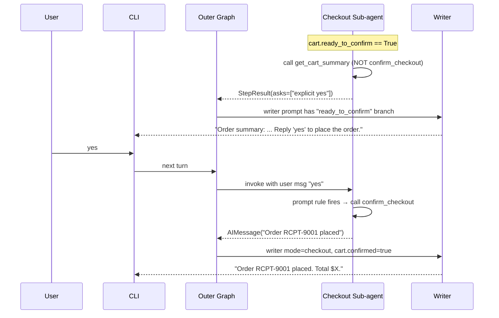

### Why we removed `HumanInTheLoopMiddleware`

The earlier design used
`HumanInTheLoopMiddleware(interrupt_on={"confirm_checkout": True})`,
which fires a LangGraph `interrupt()` *before* the tool runs and
suspends the entire graph mid-turn. The CLI then has to handle a
resume path (`Command(resume={"decisions": [...]})`).

That works, but it's surprisingly heavy:

- Requires a checkpointer on the sub-agent.
- Threads a `pending_hitl` field through outer state.
- Splits the CLI into "normal turn" and "resuming turn" branches.
- Blocks the whole pipeline (supervisor → writer → gate → validator)
  mid-turn — every observer of the graph stream has to know to
  resume.

For a prototype / demo the cost outweighs the benefit. The cart's
own `ready_to_confirm()` already guards the tool body, and the
outer `checkout_gate` re-asserts blockers post-writer. The remaining
risk — that the model fires `confirm_checkout` when the user said
something ambiguous — is mitigated by:

1. A strict rule in the checkout system prompt:
   > NEVER call confirm_checkout automatically. Only call it on a
   > subsequent turn after the user's most recent message is an
   > explicit approval like "yes", "y", "confirm", "place the order".
2. The writer prompt's `ready_to_confirm` branch, which always ends
   the message with "Reply 'yes' to place the order" so the user
   knows exactly how to approve.
3. The fact that `confirm_checkout` checks
   `cart.ready_to_confirm()` and refuses if blockers remain.

### When to re-add the middleware

Production-grade safety on irreversible actions — actually charging
a card, sending an email, deleting data, anything the user can
sue you over — should still use `HumanInTheLoopMiddleware`. The
infrastructure is one import + one middleware list entry away (the
sub-agent already takes a `checkpointer` kwarg). For the demo flow,
the prompt rule is enough.

---

## 10. Long-term memory

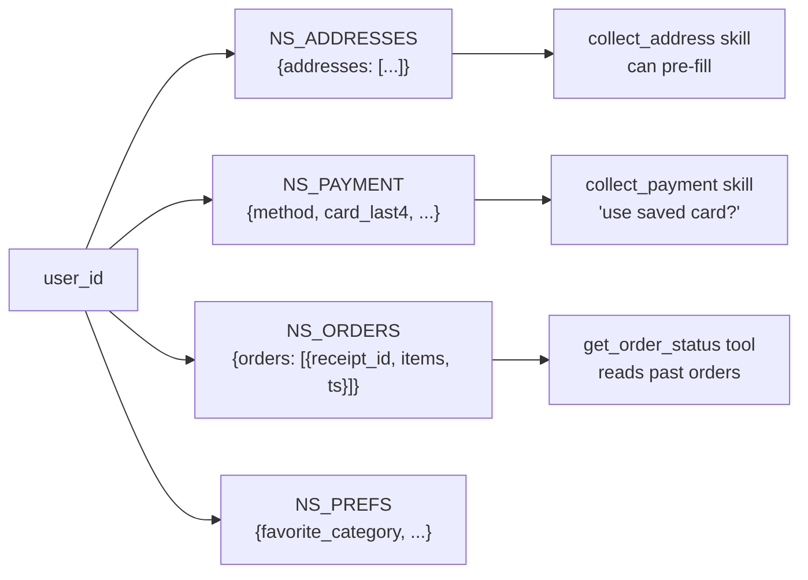

Built on `langgraph.store.memory.InMemoryStore` — same interface as
the prod-ready stores. Each tool reads `runtime.store` to get/put
namespaced records keyed by `user_id`. The `confirm_checkout` tool
writes to all three namespaces (address, payment, orders) on
success.

### What's good

- Same interface as the SQLite / Postgres stores: swap in 1 line,
  no downstream changes.
- Per-user isolation by namespace key.
- Tools that ignore the store still work — it's optional.

### What's bad

- Doesn't survive process restart. Fine for the demo; obviously not
  for prod.
- No TTL, no eviction. Carts that never get confirmed and addresses
  that get typo'd never expire. Production needs a periodic cleanup
  job.
- No PII redaction. We store `card_token` (would be a vault id in
  reality) and the last 4 digits, but the architecture doesn't
  enforce that. A `BasePIIRedactor` layer between tool and store
  would be a healthy add.

---

## 11. What's good (and why)

| What | Why it works |
|---|---|
| **Pydantic cart with computed step** | Step machine can't drift from state; tests are fast and pure-state. |
| **Fingerprinted quotes** | Invalidation is automatic — no "set dirty" calls scattered around. |
| **All cart mutations through `CartService`** | One place to read to understand invalidation policy. |
| **Skill ladder + constrained tools** | LLM can't skip steps even if it tries; system prompt stays small. |
| **Supervisor loop with hints + short-circuits** | Compound asks work; smalltalk costs one LLM call, not three. |
| **Writer as the only voice** | Consistent tone, single place for safety/i18n; sub-agents stay focused. |
| **Defense-in-depth gate** | Hallucinated confirmations are physically impossible to emit. |
| **Prompt-gated confirmation** | Single coherent turn flow; no graph suspension; `HumanInTheLoopMiddleware` slot is ready to re-enable when production safety demands it. |
| **InMemoryStore with prod-shaped interface** | Same code works against a real backend. |

---

## 12. What's bad (and why we kept it that way for now)

| Pain | Mitigation today | Production fix |
|---|---|---|
| **3 LLM calls on a busy turn** (classifier + sub-agent + writer) — latency ~3-4s | Smalltalk short-circuit, hint pathway | Stream tokens; speculative sub-agent dispatch; cache classifier on cache-friendly keys |
| **Writer can still hallucinate** product ids or zip codes when payload is sparse | Strict prompt + gate as backstop | JSON-mode response_format on the writer; templated formatting for known-shape responses |
| **Smalltalk heuristic is keyword-list** | Conservative — only fires on short messages with all-known tokens | Distill a tiny intent classifier; or use the LLM with `logit_bias` |
| **Supervisor re-classification cost** | Already-ran-this-SOP guard; max iterations | Cache decisions per (state hash, last user msg hash) |
| **Cart blockers list grows with every concern** | Filter to user-actionable in writer payload | Group blockers by step; show only the next-required step |
| **No streaming to the user** — they wait for the full turn | None | LangGraph's `stream_mode="messages"` for token-level streaming from the writer |
| **InMemoryStore loses data on restart** | None | Plug in `langgraph.store.sqlite` or build a SQLAlchemy adapter |
| **No retry on tool failure inside sub-agents** | None | A `wrap_tool_call` middleware that retries 503s with backoff |
| **Tests stub the LLM at the boundary** — they don't catch prompt regressions | Pure-state tests cover invariants; structural tests cover wrappers | Add evaluation harness with recorded conversations + LLM-as-judge |

---

## 13. Cost & latency: actual numbers

A "real" estimate based on `gpt-4.1-mini` pricing (~$0.40/M input,
$1.60/M output tokens), conservative token counts, and observed
behavior:

| Turn type | LLM calls | Approx tokens | Cost | Latency |
|---|---|---|---|---|
| Smalltalk ("hi") | 1 (writer) | ~400 in / 80 out | ~$0.0003 | ~500ms |
| Single browse ("show me hats") | 3 (classifier + product_rec + writer) | ~1500 in / 200 out | ~$0.001 | ~2-3s |
| Compound ask ("green cap and pay") | 4 (classifier + product_rec + checkout + writer) | ~2500 in / 350 out | ~$0.002 | ~4-5s |
| Mid-checkout reply ("zip is 94110") | 3 (classifier + checkout + writer) | ~2000 in / 250 out | ~$0.0015 | ~3s |
| Order confirmation (yes after summary) | 3 (classifier + checkout + writer) | ~1800 in / 200 out | ~$0.001 | ~2-3s |

Latency adds up. The dominant cost is not the model — it's the
*number of round-trips*. Two improvements that would each cut total
latency ~30%:

1. **Skip the classifier on obvious follow-ups.** Currently, if the
   user is mid-checkout and replies with what looks like checkout
   data (zip, name, "yes"), we still ask the classifier. A small
   regex pre-filter would skip the call ~50% of the time.
2. **Parallel sub-agent invocation for compound asks.** The
   compound case currently runs product_rec then checkout
   sequentially. They share state (the cart) so true parallelism is
   tricky, but a *speculative* invocation pattern — start the next
   sub-agent while the writer composes — would hide latency.

---

## 14. Accuracy: where the model is wrong, and why

We've seen four classes of accuracy problems in dev:

1. **False-positive product matches** (was a substring-match bug;
   fixed by whole-word search in `catalog.search`).
2. **Wrong SOP routing on ambiguous one-word replies** ("yes" after
   the assistant asked about delivery → was getting routed to
   product_rec). Fixed by giving the supervisor 8 turns of history
   and a stricter prompt.
3. **Wrong sub-agent output framing** — sub-agents used to write
   their own user-facing text in mismatched tones. Fixed by the
   writer being the only voice.
4. **Hallucinated confirmations** — the model would say "your
   order is placed!" without actually calling `confirm_checkout`.
   Caught by `checkout_gate` AND prevented by the HITL middleware
   (since confirm_checkout always interrupts before running).

What's still imperfect:

- **Multi-language**: prompt is English-only. The writer mode
  framework is the right place to add localization (one prompt
  variant per locale) but we haven't done it.
- **Negation handling**: "I don't want to ship to Paris" is hard.
  We get this right ~80% of the time. Larger model + better prompt
  would help; structured output for the user's intent might be
  necessary.
- **Edge-case promos**: complex promo eligibility rules ("free
  shipping on orders > $100 from California") would need extending
  the promo module. The architecture supports it; we just have two
  hard-coded promos for the demo.

---

## 15. Alternative architectures we considered

### 15a. Pure `create_agent` + supervisor-as-tools (the LangChain v1 recommended pattern)

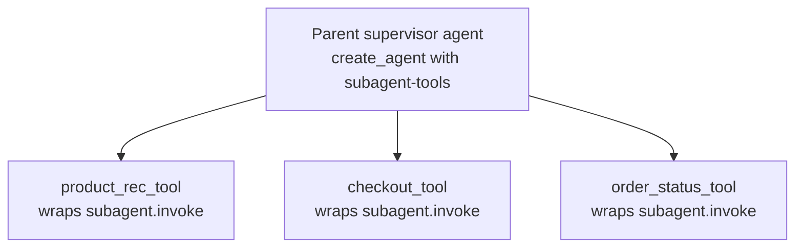

The supervisor is a `create_agent` itself, with each sub-agent
exposed as a `@tool` that returns text. The model decides who to
call and synthesizes the result.

**Why we didn't:** the model would have to enforce invariants like
"don't call confirm_checkout if cart has blockers" through *prompt*,
not through code. There's no `Cart.ready_to_confirm()` gate the
parent agent can rely on — it'd have to trust the sub-agent's
self-report. Worse: the parent decides "we're done" implicitly by
not calling more tools, which gives less control over the loop.

This pattern shines when sub-agents are *independent knowledge
domains* (a research agent + a math agent + a code agent), less so
when they share business state.

### 15b. Swarm (the LangChain "swarm" pattern)

Same as 15a but agents can hand off directly to each other without
a central supervisor.

**Why we didn't:** even less control. Two agents passing the user
between them with no global view is hard to debug and impossible to
gate.

### 15c. Planner-Executor

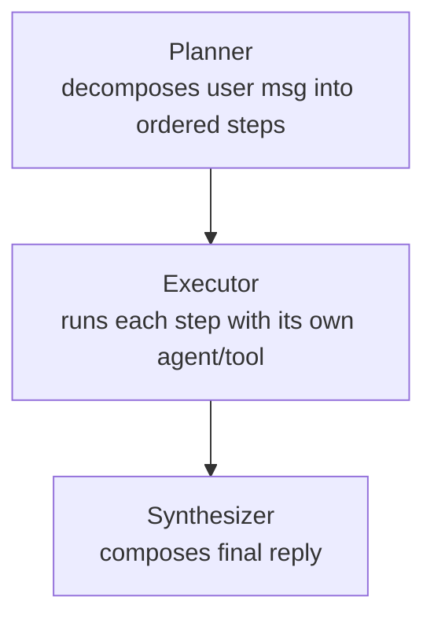

A planner agent produces a JSON plan upfront, the executor runs
each step.

**Why we didn't:** overkill for our problem and rigid in the face
of recovery ("step 2 failed; replan"). The supervisor-loop pattern
is essentially a *reactive* planner — it decides one step at a
time, informed by what just happened. For long-horizon tasks (5+
steps), an explicit planner makes more sense; for ours (2-3 steps
max), it's overhead.

### 15d. Pure deterministic state machine, no LLM in the loop

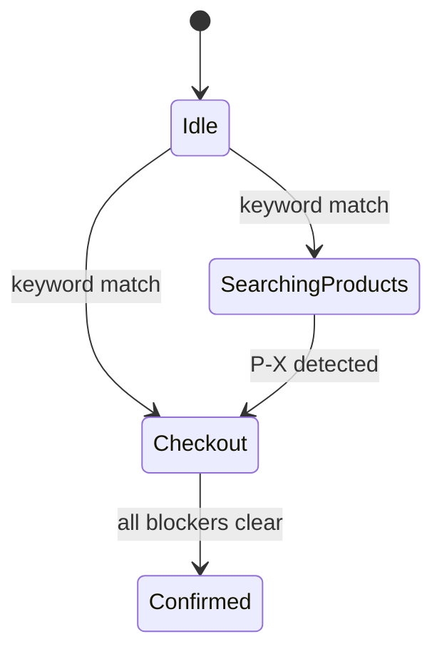

This is what the old `ocean_beach` SOPs were — hand-rolled state
machines.

**Why we didn't:** terrible at natural language. "I want something
black and warm for my dad" requires LLM understanding. Going LLM-
free trades accuracy for predictability — fine if the user input is
constrained (button-driven UI), bad for free-text chat.

### Our hybrid is the middle path

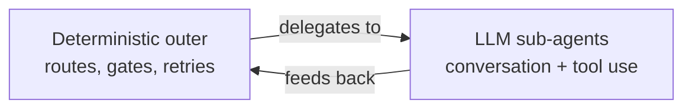

The LLM only runs INSIDE bounded boxes. Routing decisions stay
deterministic (the classifier returns a typed `SupervisorDecision`,
which is then *acted on* deterministically). Invariants are checked
in Python. The model has no path to bypass them.

---

## 16. What we'd build next

Ordered by impact:

1. **Streaming.** `graph.stream(stream_mode="messages")` would let
   the user see the writer's tokens as they arrive — perceived
   latency drops a lot.

2. **Pluggable language layer.** Move writer prompts into per-
   locale files, with one shared "structural" prompt and locale-
   specific tone. Most production systems land here within months
   of launch.

3. **A real persistence layer.** Plug
   `langgraph.checkpoint.sqlite.SqliteSaver` into the sub-agent and
   a SQLAlchemy-backed store. Then sessions survive process
   restart.

4. **An eval harness.** Right now we lock in invariants via unit
   tests, but the writer's output quality has no automated check.
   Recorded conversations + LLM-as-judge would catch prompt
   regressions before they hit users.

5. **Tool-call retries.** A `wrap_tool_call` middleware that
   retries 5xx errors with exponential backoff (and surfaces a
   clean error string on terminal failure) would make the system
   robust to flaky downstreams.

6. **Streaming cart preview to the UI.** The cart panel updates
   per-turn. With a websocket layer, it could update per tool-call
   (mid-turn).

7. **A "memory consolidation" pass.** A periodic background agent
   that compacts the user's saved addresses ("you've ordered to
   these 3 places, want to label them home/work/parents?"). Real
   product touch but architecturally easy in the existing store.

8. **Multi-agent parallelism** for genuine fan-out cases. Searching
   our catalog + a partner catalog simultaneously for product_rec,
   then merging. The bones (`StepResult` accumulation) are already
   there.

---

## 17. Reading order for someone joining the team

If you're new and want to grok this codebase in an afternoon:

1. **`README.md`** — what is this thing, how do I run it.
2. **`agent_v2/checkout/cart.py`** — the heart. Read top to bottom.
3. **`agent_v2/checkout/service.py`** — the mutation funnel.
4. **`agent_v2/state.py`** — what's threaded through every node.
5. **`agent_v2/supervisor.py`** — routing logic, no LLM math.
6. **`agent_v2/graph.py`** — outer wiring. Read alongside the
   mermaid diagram in section 2 of this doc.
7. **`agent_v2/sops/checkout.py`** — `create_agent` configuration.
8. **`agent_v2/skills/checkout_skills.py`** — the 5 sub-skill prompts.
9. **`agent_v2/writer.py`** — the only voice.
10. **`tests/test_cart_invariants.py`** + **`test_cart_invalidation.py`**
    — read these to understand what's *guaranteed*. They're fast,
    pure-Python, and they specify behavior.

The tests are intentionally readable as documentation. If anything
in the cart should change, those tests should change too — and
that's a deliberate forcing function.

---

## 18. Closing

The two non-obvious choices that make this work:

1. **Invariants belong in code, conversation belongs to the LLM.**
   Every time we put an invariant in a prompt, the model eventually
   broke it. Every time we put one in a Pydantic model, it stayed
   broken (in a good way).

2. **The graph topology is a contract.** Once supervisor → SOP →
   writer → gate → validator → emit is fixed, you can reason about
   it without re-reading code. The contract leaves the LLM with
   freedom inside each node but no freedom *between* nodes.

If you're building something similar, those are the two ideas worth
stealing.
