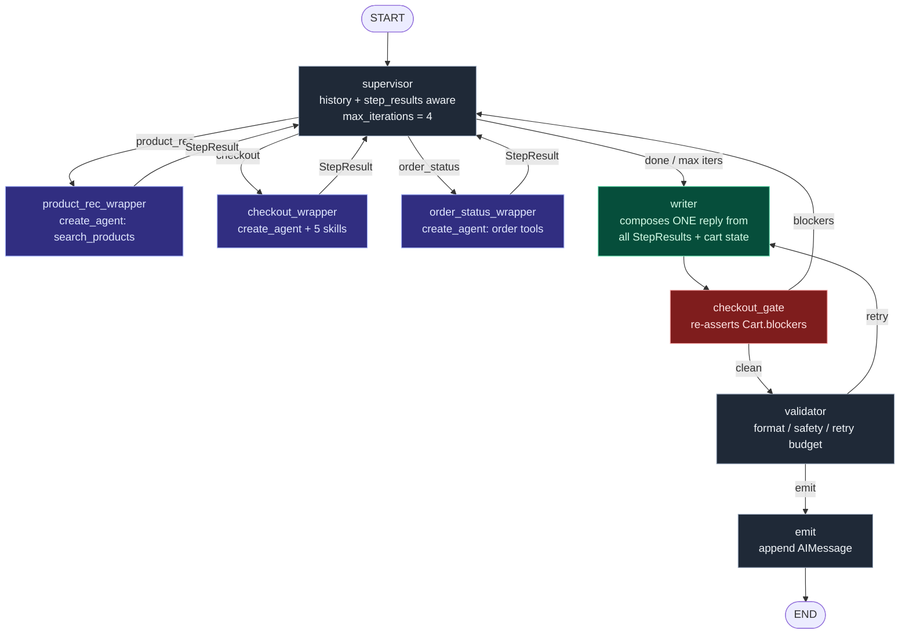
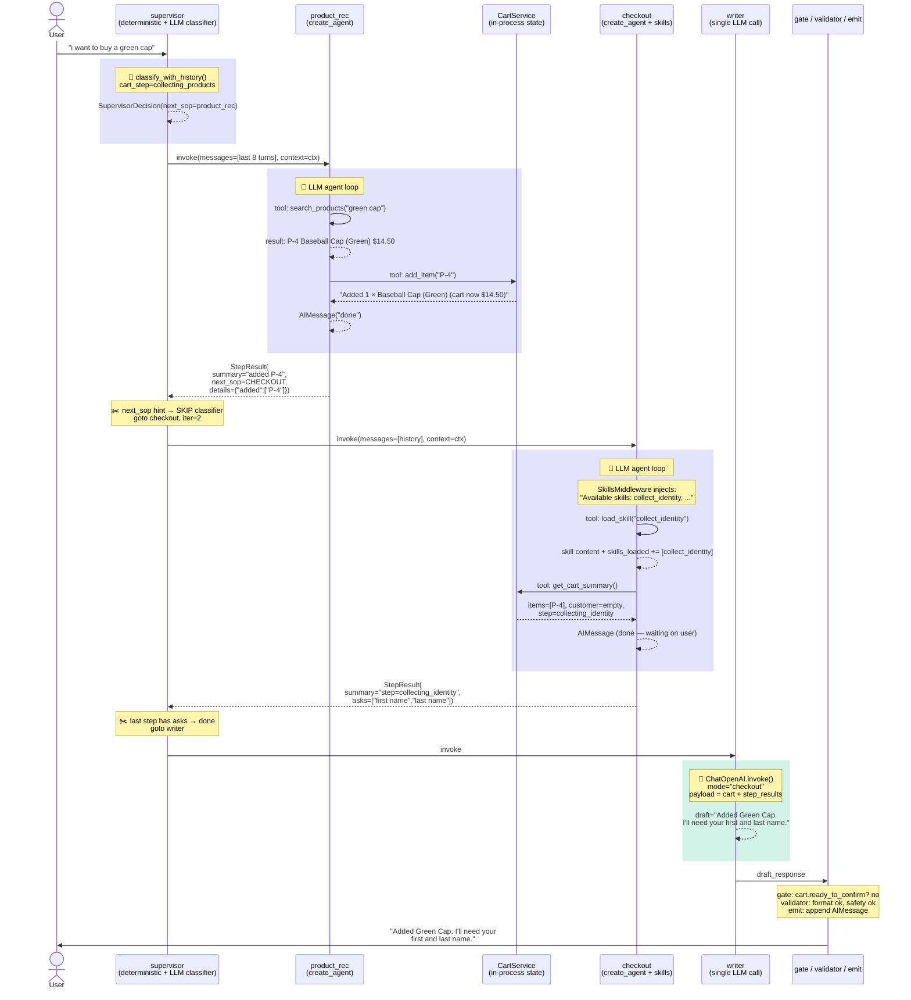
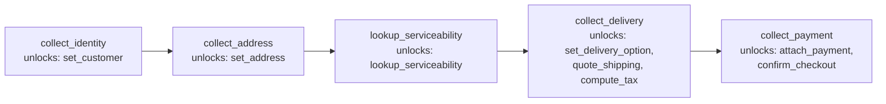
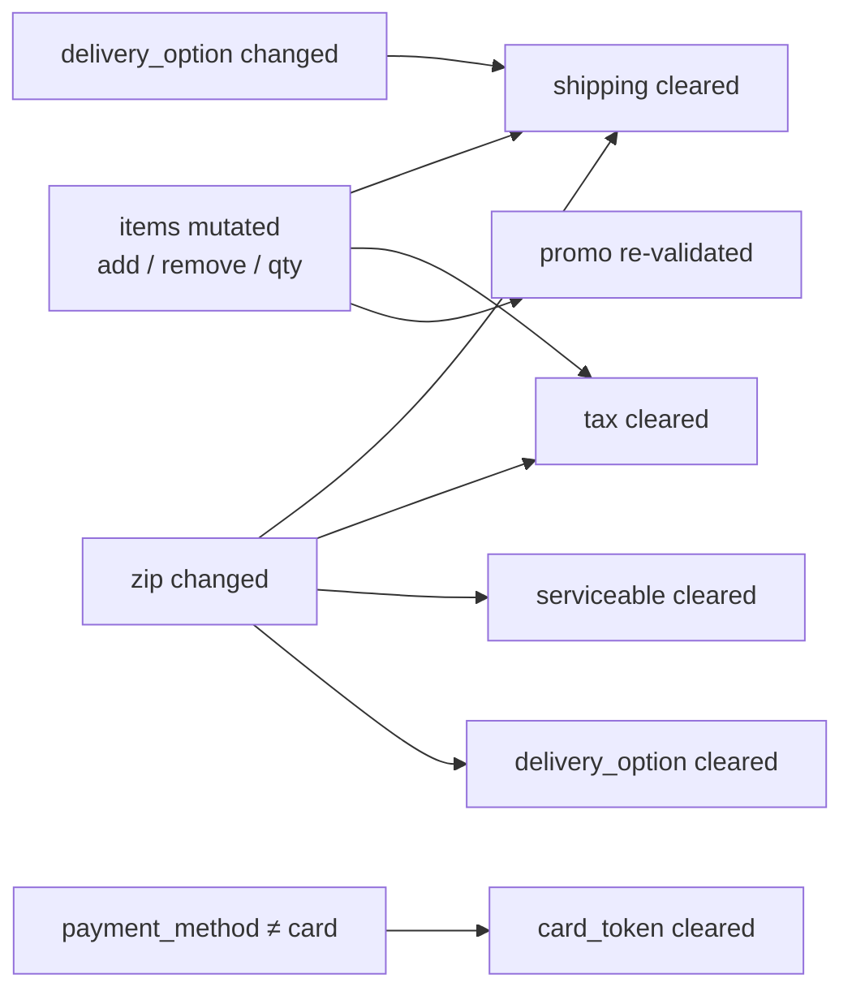

# `agent_v2` — multi-agent checkout with skills, writer, and a rich TUI

> **For the deep-dive technical writeup** — design rationale,
> trade-offs, cost/latency analysis, alternative architectures, and
> what to build next — see **[`ARCHITECTURE.md`](ARCHITECTURE.md)**.

A clean-room, opinionated multi-agent system built on **LangChain 1.x**
+ **LangGraph 1.x**. A supervisor loop routes user turns to one of
three sub-agents (checkout, order status, product recommendations).
The checkout sub-agent operates a typed cart through **five
sequentially-loaded skills**, gates order placement on an explicit
"yes" from the user, and persists addresses / payment / orders to a
long-term memory store.

A single **writer agent** at the end of every turn composes the
user-facing reply from the accumulated structured step results — no
sub-agent talks to the user directly. This keeps tone consistent and
gives one place to enforce safety / format / i18n.

The architecture is **hybrid by design**:

- The **outer graph** is a raw `StateGraph` with `Command(goto=…)` for
  deterministic routing, invariant gating, and validation. The cart's
  "you can't confirm without a valid payment and a fresh tax quote"
  rule lives here.
- Each **sub-agent** is built with `create_agent` and uses LangChain's
  middleware system (skills, tool-call logging). This is the
  LLM + tool-calling conversation loop.
- The supervisor sees the **last N turns of conversation history** and
  the **structured step results from this turn**, so it can adjudicate
  compound asks ("add the green cap and pay") and one-word follow-ups
  ("94110" after a previous "what's your zip?").

---

## Top-level architecture



### What each piece does

| Layer | File | Responsibility |
|---|---|---|
| Supervisor | `agent_v2/supervisor.py` | History- + step-result-aware classifier. Loop of up to 4 iterations. Routes via `Command(goto=…)`. |
| Checkout sub-agent | `agent_v2/sops/checkout.py` | `create_agent` with `SkillsMiddleware`, `log_tool_calls`. Confirmation is prompt-gated. |
| Other sub-agents | `agent_v2/sops/product_rec.py`, `sops/order_status.py` | `create_agent` wrappers. |
| Wrappers | `agent_v2/graph.py` | Invoke each sub-agent, capture cart mutations, return a `StepResult`. |
| StepResult | `agent_v2/step_result.py` | Structured handoff between sub-agents and writer (summary, asks, next_sop hint). |
| Writer | `agent_v2/writer.py` | **The only agent that talks to the user.** A single `ChatOpenAI` call over a structured JSON payload. |
| Cart (state of truth) | `agent_v2/checkout/cart.py` | Pydantic `Cart` with `step` tracker, freshness-aware quotes, and `blockers()`. |
| Cart mutations | `agent_v2/checkout/service.py` | `CartService` — every mutation goes through here so invalidations are policy-driven, not ad-hoc. |
| Skills | `agent_v2/skills/checkout_skills.py` | Five sub-skills, the `Skill` TypedDict, the `load_skill` tool factory. |
| Middleware | `agent_v2/middleware/` | `SkillsMiddleware`, `log_tool_calls`. |
| Long-term memory | `agent_v2/memory.py` | `InMemoryStore` + namespace helpers (addresses, payment, orders, prefs). |
| Runtime context | `agent_v2/runtime.py` | `@dataclass RuntimeContext` — typed, injected via `agent.invoke(..., context=…)`. |
| Outer graph | `agent_v2/graph.py` | Wrappers, writer, gate, validator, emit. Exports the `graph` singleton for Studio. |
| CLI | `agent_v2/cli.py` | Split-screen `rich.Live` TUI streaming every event (USER → ROUTER → AGENT → SKILL → TOOL → STEP → WRITER → BOT). |

---

## Walkthrough: a single turn, end-to-end

Let's trace a real example. The user is on a fresh session and types:

> *"i want to buy a green cap"*



### Step by step

1. **Supervisor classifies** (LLM call #1). The classifier sees:
   - Recent conversation: just the user's message
   - `cart_step=collecting_products`
   - No prior step results
   It returns `SupervisorDecision(done=false, next_sop=product_rec)`.

2. **product_rec sub-agent runs** (LLM call #2 — multi-turn agent loop).
   - Tool call: `search_products("green cap")` → P-4.
   - Tool call: `add_item("P-4")` (the user said "buy", not just "browse",
     so the model goes straight to adding).
   - Returns a final AIMessage to indicate it's done.

3. **The wrapper observes cart growth.** `cart.items` went 0 → 1.
   It builds a `StepResult` with `summary="added P-4"`,
   `next_sop=CHECKOUT`, and `details={"added": ["P-4"]}` so the writer
   has structured data.

4. **Supervisor follows the next_sop hint — NO classifier call.**
   This is the loop's fast path: when a sub-agent knows where to go
   next, the supervisor doesn't re-classify, saving an LLM round-trip.

5. **checkout sub-agent runs** (LLM call #3 — multi-turn agent loop).
   - Sees cart has P-4 but customer is empty.
   - First tool call: `load_skill("collect_identity")` — the system
     prompt's strict rule is "always load_skill before using its
     unlocked tools".
   - Tool call: `get_cart_summary()` to inspect what's still needed.
   - The model decides it's waiting on the user (it doesn't have a
     first/last name to pass), so it finishes the turn without
     calling `set_customer`.

6. **The wrapper translates `cart.step=collecting_identity` to asks.**
   `_asks_for_step()` maps the step to `["first name", "last name"]`
   so the writer can prompt for them clearly.

7. **Supervisor short-circuits to the writer.** The most recent
   StepResult has non-empty `asks` → the user must respond before any
   more SOP work makes sense. No classifier call here either.

8. **Writer composes** (LLM call #4 — single ChatOpenAI call).
   Receives a structured JSON payload (`mode="checkout"`, cart
   snapshot, step results) and produces one user-facing message.

9. **Gate, Validator, Emit.** Gate checks `cart.ready_to_confirm()`
   (false, no hallucinated confirmation issue). Validator checks
   format / safety. Emit appends the AIMessage to the conversation.

### What carries to the next turn

When the user replies *"Julien Doe"*:

- `state.skills_loaded` still contains `["collect_identity"]` → no
  re-load needed.
- `state.cart` already has P-4 in it → no re-add.
- The supervisor sees `cart_step=collecting_identity` and a recent
  assistant message asking for a name; classifier routes to
  **checkout** directly.
- The checkout sub-agent calls `set_customer("Julien", "Doe")`, then
  `load_skill("collect_address")` to unlock the next step.
- And so on through the 5 skills, one user-reply at a time, until
  `ready_to_confirm`. The writer then presents the order summary
  with "Reply 'yes' to place the order" — and only when the user
  literally types "yes" does the next turn's checkout sub-agent call
  `confirm_checkout`.

### Cost note

That single turn is **4 LLM calls**. The hot-path optimizations
above (next_sop hints, asks short-circuit) saved 2 extra classifier
calls that a naive implementation would have made. See
[`ARCHITECTURE.md` §13](ARCHITECTURE.md) for the full cost/latency
breakdown by turn type.

---

## The checkout flow — five sequentially-loaded skills

```mermaid
stateDiagram-v2
    direction LR
    [*] --> collecting_products: cart empty
    collecting_products --> collecting_identity: items added
    collecting_identity --> collecting_address: set_customer
    collecting_address --> awaiting_serviceability: set_address (zip changed → shipping/tax cleared)
    awaiting_serviceability --> collecting_delivery: lookup_serviceability (success)
    awaiting_serviceability --> collecting_address: lookup_serviceability (not serviceable)
    collecting_delivery --> collecting_payment: set_delivery_option + quote_shipping + compute_tax
    collecting_payment --> ready_to_confirm: attach_payment
    ready_to_confirm --> confirmed: user replied "yes" → confirm_checkout
    ready_to_confirm --> collecting_payment: user changed mind
```



Each step corresponds 1:1 to a sub-skill the checkout sub-agent
must `load_skill(...)` before its tools are usable. The constrained
tools refuse if their required skill isn't loaded, and the outer
`checkout_gate` re-asserts `Cart.blockers()` after every checkout
turn — so even if the model hallucinates a "confirmed!" message, the
gate bounces it back.

### Skill ladder



---

## Invalidation rules (a defensive cart)

The cart tracks the *fingerprint* (sorted item list × zip × delivery
option) that each derived quote was computed for. If any input
changes, the quote is automatically considered stale.



This invalidation policy lives in `CartService` (one place, easy to
audit) — not scattered through tool implementations.

---

## Confirmation: prompt-gated, not blocking

When the cart reaches `ready_to_confirm`, the **checkout sub-agent
deliberately does NOT call `confirm_checkout`** — its system prompt
forbids it. Instead the wrapper emits an `asks=["explicit yes to
place the order"]` step result, and the writer formats a short order
summary that ends with "Reply 'yes' to place the order."

On the next turn, the user's "yes" / "y" / "confirm" flows through
the normal turn pipeline. The supervisor routes to checkout, the
sub-agent's prompt rule recognizes the explicit approval, calls
`confirm_checkout`, and the receipt is issued.

We dropped `HumanInTheLoopMiddleware` for this demo — see
[`ARCHITECTURE.md` §9](ARCHITECTURE.md) for the full discussion of
why (and when to put it back). The short version: HITL middleware
suspends the entire graph mid-turn, which is heavy for a prototype.
The cart's `ready_to_confirm()` invariant + the outer
`checkout_gate` are sufficient backstops here. For production
charging-real-money systems, re-add the middleware.

---

## Long-term memory (per-user)

| Namespace | Key | Value | Read by | Written by |
|---|---|---|---|---|
| `addresses` | `user_id` | `{addresses: [...]}` | `collect_address` skill | `confirm_checkout` |
| `payment` | `user_id` | `{method, card_last4, card_token_ref}` | `collect_payment` skill | `confirm_checkout` |
| `orders` | `user_id` | `{orders: [...]}` | `get_order_status`, `list_recent_orders` | `confirm_checkout` |
| `preferences` | `user_id` | `{favorite_category, …}` | `product_rec` (TODO) | manual / future |

Memory is exposed to tools as `runtime.store` (auto-injected by
LangGraph when the sub-agent is compiled with `store=`).

---

## Setup

You need **Python 3.11+** and an **OpenAI API key**.

```bash
# 1. clone / cd
cd python/agent_v2

# 2. install (editable)
python -m pip install -e .

# 3. configure env via .env (auto-loaded at import)
cp .env.example .env
$EDITOR .env       # paste OPENAI_API_KEY=sk-...
```

`.env` is loaded automatically by `agent_v2.__init__` (see
`agent_v2/__init__.py`) — both `python -m agent_v2.cli` and
`langgraph dev` pick it up without manual `export`. The loader checks
the package dir first, then the caller's CWD; real environment vars
always win.

Variables you can set in `.env`:

| Var | Default | Purpose |
|---|---|---|
| `OPENAI_API_KEY` | (required) | OpenAI auth. |
| `AGENT_V2_OPENAI_MODEL` | `gpt-4.1-mini` | Main model for sub-agents + supervisor classifier. |
| `AGENT_V2_WRITER_MODEL` | (falls back to above) | Cheaper model for the writer. |
| `LANGSMITH_API_KEY` | unset | Only needed for the hosted LangGraph Studio UI. |
| `AGENT_V2_DEBUG` | `false` | When `true`, prints colorized Rich event lines to stderr (same scheme as the CLI). Subagents must stream with custom events forwarded for SKILL/TOOL in the web UI. |

### Run the Next.js debug console (recommended)

A polished browser UI: split-pane live cart state on the left, color-
coded event stream on the right (with a chat tab), input at the bottom.
Streams Server-Sent Events from a tiny FastAPI bridge.

```bash
# 1. install server deps (one-time)
pip install -e ".[server]"

# 2. run the API bridge (port 8001)
uvicorn server.main:app --reload --port 8001

# 3. in another terminal: the web app (port 3000)
cd web
npm install
npm run dev
# open http://localhost:3000
```

See [`web/README.md`](web/README.md) for details and screenshots.

### Run the rich CLI (no Node required)

```bash
python -m agent_v2.cli
```

Left panel shows the live cart state (step, items, address,
serviceability, blockers, grand total). Right panel streams every
event: USER → ROUTER → AGENT → SKILL → TOOL (with args + truncated
result) → STEP (structured handoff to supervisor) → WRITER (final
draft) → BOT (emitted message).

When the cart is ready to place, the writer presents an order
summary and asks you to type `yes` to confirm. Anything else (or
asking another question) just continues the conversation — the order
won't go through until you explicitly approve.

Example compound ask (the kind that needs the supervisor loop):

```
you> add me the green cap and pay
   ROUTER  → product_rec (iter 1)        # classifier picks search first
   AGENT   product_rec_wrapper finished
   STEP    product_rec: added P-4 to cart → checkout
   ROUTER  → checkout (iter 2)           # follows next_sop hint
   AGENT   checkout_wrapper finished
   SKILL   load → collect_identity
   STEP    checkout: at step=collecting_identity asks=['first name', 'last name']
   ROUTER  → writer (done)
   WRITER  I added Green Baseball Cap (P-4, $14.50) to your cart. To
           place the order I'll need your first and last name to start.
   BOT     I added Green Baseball Cap (P-4, $14.50) to your cart. …
```

Notice the supervisor fires **twice** in this single turn, and the
**writer** speaks once, summarizing everything that happened.

### Run LangGraph Studio

```bash
# requires langgraph-cli (installed with the package)
langgraph dev
```

Opens at `http://127.0.0.1:2024` — visit
`https://smith.langchain.com/studio/?baseUrl=http://127.0.0.1:2024` to
see the graph topology and step through state diffs.

### Run tests

```bash
python -m pytest tests -q
```

Pure-state tests (cart invariants, invalidation, skill gating) run
without network. Higher-level tests use a stub OpenAI client; no API
key required.

---

## Try-it-yourself scenarios

The CLI is designed for you to break the system on purpose. Here are
five worth trying:

1. **Happy path** — buy a hoodie, ship to SF, 2-hour delivery, pay
   by card. Reply `yes` to confirm.

2. **Address change invalidates everything** — fully fill the cart,
   quote shipping + tax. Then say "actually ship to 75001 Paris
   instead." Cart should clear `serviceable`, `delivery_option`,
   shipping, and tax. The agent should re-load
   `lookup_serviceability` before quoting again.

3. **Unserviceable zip** — give a zip like `99999`. The
   `lookup_serviceability` tool sets `serviceable=False`, and the
   gate refuses to let the agent advance until the user provides a
   different address.

4. **Cart drift mid-flow** — once you're at `collecting_payment`,
   add another item. Items change → shipping + tax become stale →
   `Cart.step` regresses to `collecting_delivery` (because the
   freshness check trips). The agent needs to re-quote.

5. **Decline the order** — at the "Reply 'yes' to place the order"
   prompt, type something else (e.g. "actually, change my delivery
   to standard"). The order is NOT placed; the agent processes your
   new request and the writer asks again once you're ready.

---

## How to extend

### Add a new SOP

1. Build the sub-agent with `create_agent` in
   `agent_v2/sops/<name>.py`.
2. Add `<name>` to `SOPName` in `supervisor.py`.
3. Add the description to `_CLASSIFIER_PROMPT`.
4. Wire a `<name>_wrapper` in `graph.py` (mirror
   `order_status_wrapper`) that:
   - calls the subagent's `.invoke(...)`
   - returns a `StepResult` with a one-line `summary` and any
     outstanding `asks`
   - hints `next_sop` if more SOP work is needed this turn

### Add a new sub-skill to checkout

1. Add the prompt + `Skill` entry to `skills/checkout_skills.py`.
2. List the tool names it should unlock in `unlocks`.
3. Add `_require_skill(runtime, "<skill_name>")` at the top of those
   tools in `tools/checkout_tools.py`.

### Add a new constrained tool

```python
@tool
def my_tool(
    arg: str, runtime: ToolRuntime[RuntimeContext] = None
) -> str:
    """One-line description."""
    err = _require_skill(runtime, "the_skill_that_unlocks_me")
    if err:
        return err
    return runtime.context.cart_service.my_method(arg)
```

Then add the tool name to the skill's `unlocks` list.

### Swap memory backend

Replace `build_store()` in `agent_v2/memory.py` to return a
SQLite/Postgres-backed `BaseStore`. The store interface is identical;
no other code changes.

---

## Design choices worth noting

- **Pydantic state on the OUTER graph.** LangGraph 1.0 keeps raw
  `StateGraph` backward-compat. The rich `Cart` model belongs here
  because that's where invariants live.
- **TypedDict state INSIDE sub-agents.** `create_agent` requires
  TypedDict — `SkillsAgentState` extends LangChain's `AgentState`
  with `skills_loaded` only.
- **Constrained tools refuse rather than throw.** They return an
  error *string*, which the model can read and recover from. That's
  more graceful than a Python exception bubbling up.
- **The gate is defense in depth.** The skill ladder + constrained
  tools are the *first* line of defense; `checkout_gate` is the
  *second*. Both check the same `Cart.blockers()` — the gate just
  catches the case where the model lies in its message text.
- **Tools mutate state through `CartService`, never directly.**
  This is the single place invalidation policy lives.

---

## Status / known limitations

- Memory uses `InMemoryStore` — does NOT survive process restart.
  Swap `build_store()` for a SQLite-backed implementation in prod.
- The supervisor loop is capped at `MAX_ITERATIONS = 4`. Compound
  asks that need more than ~3 SOP hops will be cut off and handed
  to the writer with whatever was gathered.
- Tests cover pure-state invariants well; the graph-level tests
  stub `classify_with_history` and `ChatOpenAI` at the boundary.
- LangGraph Studio requires `LANGSMITH_API_KEY` — without one, only
  the local dev server works, not the hosted UI.
- The writer makes one extra OpenAI call per turn (small cost,
  ~300-500ms). Override with `AGENT_V2_WRITER_MODEL` for a cheaper
  model in production.

## What's new in v4

If you're coming back to this and remember the v3 design, here's
what changed:
- **Writer**: only the writer talks to the user; sub-agents return
  structured `StepResult` records.
- **Supervisor loop**: routes between sub-agents up to 4 times per
  turn (compound asks), informed by recent conversation history and
  step results.
- **`.env` autoload**: copy `.env.example` to `.env`; everything
  picks it up automatically.
- **Checkout is in `sops/`**: symmetric with the other SOPs.
- **Green / red caps**: `P-4` (green) and `P-5` (red) so colored-
  product demos work.

## `agent_v4/` — declarative, config-driven leaves (separate package)

> Naming note: this is the **`agent_v4` package**, distinct from the
> "v4 loop architecture" term above (which describes agent_v2's internal
> supervisor-loop iteration). `agent_v4/` is a parallel package, like
> `agent_v3/`; `agent_v2` is unchanged.

Same runtime shape as v2 (**1 orchestrator → n leaves → orchestrator →
writer → gate → validator → emit**), but each leaf is now *defined as
data* and the graph topology is *generated* from a registry — the
"Declarative Agent Builder" idea applied to the existing LangGraph flow.

| Piece | File | What's new |
| --- | --- | --- |
| Declarative builder | `agent_v4/configurable.py` | `AgentConfig` (model, prompt, tools, skills, guardrails, middleware) → `build_agent()` → the same `create_agent(...)` v2 wrote by hand. Registries + `build_catalog()` for a future builder UI. |
| Leaf registry | `agent_v4/leaves.py` | The 3 leaves as `AgentConfig` + their wrapper post-processors, collected in `LEAVES`. **Add a leaf = append a `LeafSpec`** — `graph.py`/`supervisor.py` adapt automatically. |
| Platform defaults | `agent_v4/registry_defaults.py` | `register_platform_defaults()` registers the v2 tools, checkout skills, and middleware by name. |
| Generated graph | `agent_v4/graph.py` | `build_graph()` loops `LEAVES` to wire one `<name>_wrapper` per leaf; gate/validator/emit unchanged. |
| Leaf ids | `agent_v4/ids.py` | Plain string ids replace v2's `SOPName` enum, keeping the leaf set data-driven. |

What the builder fixed vs the design doc: `ModelConfig.temperature`/
`max_tokens` are actually applied; `build_agent` forwards
`context_schema`/`checkpointer`/`store`; declarative `HttpTool` strips
placeholder-consumed args (e.g. `{api_token}`) from the request payload.

```bash
# tests (keyless): 65 passing
.venv/bin/python -m pytest tests_v4 -q
# server (same SSE contract / port as v2 — run one or the other)
uvicorn server.main_v4:app --reload --port 8001
# langgraph: graph registered as `agent_v4` in langgraph.json
```

Model env resolves `AGENT_V4_OPENAI_MODEL` → `AGENT_V2_OPENAI_MODEL` →
`gpt-4.1-mini` (writer: `AGENT_V4_WRITER_MODEL` → `AGENT_V2_WRITER_MODEL`),
so it runs against the existing `.env` with no new config.

### Structured "rich reply" output

The writer emits `{message, blocks[]}` instead of a bare string. `message` is
the prose (still in `draft_response`, so the gate/validator/emit/UI text paths
are unchanged); `blocks` is an ordered list of **typed** payloads
(`product_reco` / `order_status` / `checkout`) defined in
`agent_v4/output_schemas.py`. Blocks are assembled **deterministically** from
what the leaves already produced (`step_results[*].details` + cart) — the LLM
only writes the prose, so ids/prices are verbatim. A single turn carries 0, 1,
or many blocks ("show hoodies and where's my order" → a product block **and** an
order block); a plain FAQ/greeting carries none. Blocks ride on
`AIMessage.additional_kwargs` → the SSE `bot` event + `/api/state` snapshot →
the web `ChatPanel` renders them as cards (`web/components/blocks.tsx`).
