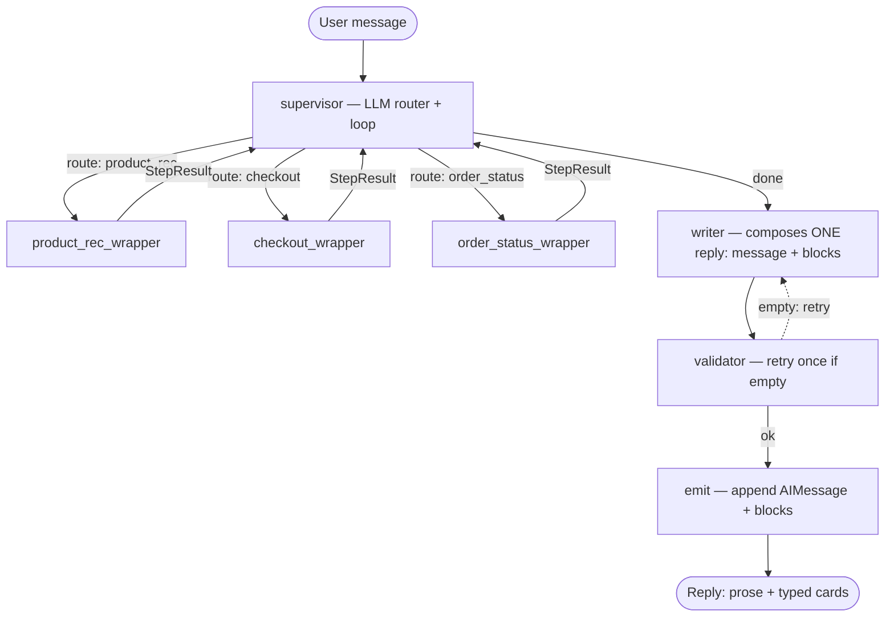
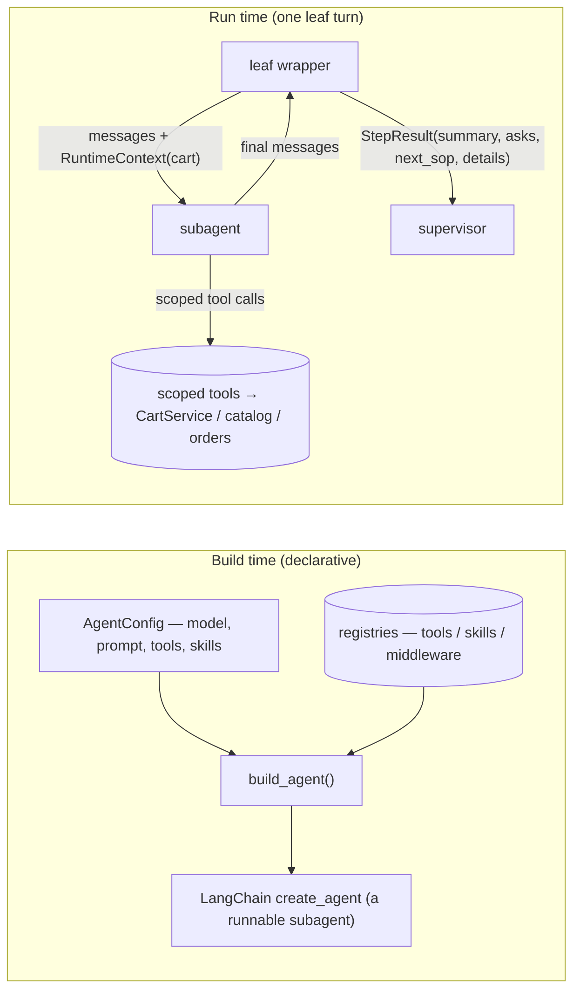
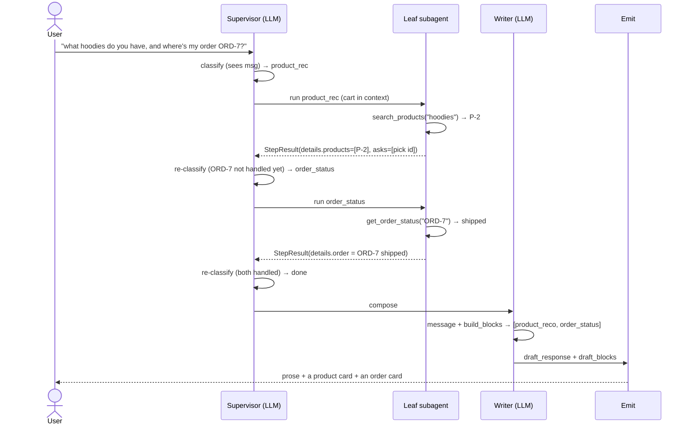

# agent_v4 — Declarative Multi-Agent Shopping Assistant

> **In one breath:** a customer-facing shopping assistant on **LangGraph**. One
> **orchestrator** (the *supervisor*) routes each user message to one or more
> **narrow, single-purpose subagents** (*leaves*), loops back to the supervisor
> after each leaf, and finally hands off to a single **writer** that produces the
> one reply the user sees — as **prose + typed structured blocks** (product cards,
> order status, checkout summary).

Two things make v4 distinct:

1. **Leaves are declarative.** Each leaf is an `AgentConfig` (plain data) compiled
   by `build_agent(...)`; the graph topology is *generated* from a registry of
   leaves. Adding a capability = appending one `LeafSpec`.
2. **Decisions are LLM-driven.** Routing and confirmation-safety are the model's
   job. There are no regex/keyword shortcuts deciding intent.

---

## 1. The big picture

The pipeline is `START → supervisor → (leaf → supervisor)* → writer → validator → emit → END`.

| Stage | Role |
| --- | --- |
| **supervisor** | The *only* router. Sees the conversation + what already ran this turn, then picks the next leaf or decides the turn is done. |
| **leaves** | Single-purpose subagents (each a LangChain `create_agent` with a **scoped** toolset). They do work via tool calls and return a `StepResult`. **Leaves never talk to the user.** |
| **writer** | The single voice. Turns the accumulated `StepResult`s + cart into one reply: a prose `message` + typed `blocks`. |
| **validator** | Minimal structural net: retry once if the writer produced no text, else emit. (No content regexes.) |
| **emit** | Appends the assistant `AIMessage` (with the structured blocks attached) and ends the turn. |

**Why this shape?** It separates *deciding what to do* (supervisor), *doing one
thing well* (a leaf), and *talking to the user* (writer). Each piece is small,
testable, and independently replaceable.

---

## 2. The components (and where they live)

| Concern | File | What it does |
| --- | --- | --- |
| Declarative builder | `agent_v4/configurable.py` | `AgentConfig` → `build_agent()` → LangChain `create_agent`. Registries for tools/skills/middleware/guardrails. |
| Leaf registry | `agent_v4/leaves.py` | The leaves as `AgentConfig`s + their wrapper post-processors + the `LEAVES` list the graph is generated from. |
| Platform defaults | `agent_v4/registry_defaults.py` | Registers the concrete tools/skills/middleware by name. |
| Orchestrator | `agent_v4/supervisor.py` | The LLM classifier + the routing policy + the loop. |
| Writer | `agent_v4/writer.py` | Builds the `{message, blocks}` reply; `build_blocks` assembles typed blocks. |
| Output blocks | `agent_v4/output_schemas.py` | Pydantic block types: `ProductRecoBlock`, `OrderStatusBlock`, `CheckoutBlock`. |
| Graph | `agent_v4/graph.py` | Compiles leaves, generates nodes, wires `validator`/`emit`, exposes `graph`. |
| State | `agent_v4/state.py` | `AgentState` (messages, cart, step_results, draft_blocks, …). |
| Leaf ids | `agent_v4/ids.py` | String ids (`checkout`, `product_rec`, `order_status`) — data-driven, no enum. |
| Domain | `agent_v4/checkout/` | `Cart`, `CartService`, catalog, serviceability, pricing (the source of truth). |
| Tools | `agent_v4/tools/` | The callable tools (catalog, checkout, order, serviceability). |
| Skills | `agent_v4/skills/` | The 5 checkout sub-skills + the `load_skill` tool (skill-gating). |
| Memory | `agent_v4/memory.py` | Long-term store (addresses, payment, past orders). |

### 2.1 The supervisor (orchestrator)

The supervisor is a **classifier + policy loop**. On each call it:

1. **Hard cap** — stop after `MAX_ITERATIONS` (4) so a bad turn can't loop forever.
2. **Follow a leaf hint** — if the last `StepResult` set `next_sop` (e.g.
   `product_rec` added an item → "go to checkout"), follow it. This is the
   *deterministic, output-aware* handoff.
3. **Classify** — otherwise call a small LLM (`SupervisorDecision = {done, next_sop, reason}`)
   that sees the recent conversation **+ every step already run this turn and its
   result**. This is what makes routing dynamic: a compound message gets handled
   one intent at a time, and a leaf's output can change what runs next.
4. **Guards** — an *empty-cart override* (never route to `checkout` with an empty
   cart) and a *re-run guard* (don't re-enter a leaf already run this turn) keep
   it sane and finite.
5. **Done → writer.** Greetings/smalltalk resolve to `done=True` *inside the
   classifier* — there is no keyword shortcut.

### 2.2 Leaves & the declarative builder

A leaf has two halves:

- The **`AgentConfig`** (in `leaves.py`) is pure data: model, system prompt, a list
  of tool *names*, optional skills, middleware. `build_agent` resolves the names
  against the registries and calls `create_agent`.
- The **wrapper** (also in `leaves.py`) is the domain glue: it runs the subagent
  with the live cart in `RuntimeContext`, inspects what happened (diffs the cart,
  reads tool outputs), and returns a structured `StepResult` for the supervisor.
- The **`LEAVES` registry** is a list of `LeafSpec`. `build_graph` loops over it to
  create one `<name>_wrapper` node per leaf — so the topology is data-driven.

### 2.3 The leaves today

| Leaf (`id`) | Responsibility | Tools | Skill-gated? | Writer block |
| --- | --- | --- | --- | --- |
| `product_rec` | Browse / recommend, serviceability, and (currently) cart edits | `search_products`, `get_product`, `check_serviceability`, `add_item`, `remove_item`, `set_quantity`, `get_cart_summary` | no | `product_reco` |
| `checkout` | The fulfillment flow: identity → address → serviceability → delivery → payment → confirm | `set_customer`, `set_address`, `lookup_serviceability`, `set_delivery_option`, `quote_shipping`, `compute_tax`, `apply_promo`, `attach_payment`, `confirm_checkout`, `get_cart_summary`, `remove_item`, `set_quantity` (+ `load_skill`) | **yes** (5 skills) | `checkout` |
| `order_status` | Look up a past order's status / tracking | `get_order_status`, `list_recent_orders` | no | `order_status` |

> **⚠️ Design debt to fix (single-responsibility):** `product_rec` currently spans
> *both* browsing **and** cart editing, and `remove_item`/`set_quantity` appear on
> **both** `product_rec` and `checkout`. That overlap violates "one job per leaf."
> The intended cleanup is to give each cart operation exactly one home (e.g.
> `product_rec` = recommend-only, and a dedicated cart capability owns
> add/remove/qty), so the supervisor always has an unambiguous leaf to route to.
> See §7.

### 2.4 Skill-gating (checkout only)

Checkout is a **sequential, gated flow**. The subagent starts with only
`load_skill` + always-on tools; each skill (`collect_identity`, `collect_address`,
`lookup_serviceability`, `collect_delivery`, `collect_payment`) must be *loaded*
before the tools it unlocks (e.g. `set_address`) will run — every gated tool checks
`skills_loaded` and refuses otherwise. This keeps checkout on rails: it can't ask
for payment before it has an address.

### 2.5 The writer — "rich reply"

The writer always produces a **`WriterReply = {message, blocks}`**:

- **`message`** — the conversational prose (FAQ answers, glue). This is the only
  part the LLM writes, and it stays in `draft_response`.
- **`blocks`** — an ordered list of **typed** payloads (`product_reco`,
  `order_status`, `checkout`) assembled **deterministically** from the leaves'
  `StepResult.details` + the cart by `build_blocks(...)`. The LLM does *not* author
  these, so ids/prices are verbatim — no hallucination.

A turn carries **0, 1, or many** blocks: "show hoodies *and* where's my order" →
a `product_reco` block **and** an `order_status` block. A pure greeting → none.

> **Confirmation safety (no gate, no regex):** the writer receives `cart.confirmed`
> as ground truth and is instructed to **never** claim the order is placed unless
> `cart.confirmed` is true. The structured `CheckoutBlock.confirmed` also comes
> from the cart, not the model. (An earlier regex "gate" was removed — it
> false-flagged normal cart descriptions.)

### 2.6 State

`AgentState` (Pydantic) is the channel everything reads/writes:

- `messages` — full conversation (LangChain messages; assistant blocks ride on
  `AIMessage.additional_kwargs`).
- `cart` — the rich `Cart` (items, customer, address, delivery, shipping/tax,
  payment, `confirmed`, `receipt_id`, and `blockers()` — the invariant safety net).
- `step_results` — what each leaf did this turn (drives routing + the writer).
- `active_sop`, `skills_loaded`, `iteration` — routing/loop bookkeeping.
- `draft_response`, `draft_blocks` — the writer's output before emit.

---

## 3. How one turn flows

Key point: the supervisor is consulted **between every leaf**, with the prior
results in hand. That's why compound and output-dependent flows work.

---

## 4. Design principles

1. **One responsibility per leaf.** A leaf does a single job and returns to the
   supervisor, which routes to the next leaf or the writer. (See §2.3 for the
   current `product_rec` debt against this rule.)
2. **The LLM makes decisions, not regex.** Intent routing, "is the turn done",
   and confirmation-safety are model judgments fed real context — not keyword
   lists or string-matching. (The smalltalk shortcut, the confirmation gate, and
   the validator's content regexes were all removed.)
3. **Structured data is assembled deterministically.** The writer's typed blocks
   are built from tool results + cart state in code, so ids/prices are exact.
4. **Declarative & data-driven.** Leaves are config; the graph is generated from
   the `LEAVES` registry. New capability = new `LeafSpec`.
5. **The cart is the source of truth.** Tools mutate `CartService`; `cart.blockers()`
   and `cart.confirmed` are invariants the writer must respect.

---

## 5. A conversation, step by step

A four-turn session. Each turn shows: **route → leaf tool calls → StepResult →
writer output**.

### Turn 1 — compound question
**User:** *"what hoodies do you have, and where's my order ORD-7?"*

1. **supervisor** classifies → `product_rec` (a product question is present).
2. **product_rec** calls `search_products("hoodies")` → finds `P-2 Black Hoodie $49.99`.
   It ignores `ORD-7` (order ids aren't products). → `StepResult(details.products=[P-2], asks=["pick a product id"])`.
3. Back at **supervisor**: the `asks` no longer ends the turn — it re-classifies,
   sees `ORD-7` is still unhandled → `order_status`.
4. **order_status** calls `get_order_status("ORD-7")` → *shipped, items P-1/P-4, tracking…* → `StepResult(details.order=…)`.
5. **supervisor** re-classifies → everything handled → **done**.
6. **writer** composes:
   - `message`: *"Here's the hoodie I found, and your order status:"*
   - `blocks`: `[product_reco(P-2), order_status(ORD-7 shipped)]`
7. **emit** → the user sees the sentence + a **product card** + an **order card**.

### Turn 2 — add to cart (handoff)
**User:** *"add the p2"*

1. **supervisor** → cart is empty, shopping intent → `product_rec`.
2. **product_rec** calls `add_item("P-2")` → cart now has `1 × P-2`. The wrapper
   diffs the cart, sees an **add**, and sets `next_sop = checkout`. →
   `StepResult(details.added=[P-2], next_sop=checkout)`.
3. **supervisor** follows the hint → `checkout`.
4. **checkout** sees the item is already in the cart (it has **no** `add_item`, so
   it can't double-add), loads `collect_identity`, and asks for the name. →
   `StepResult(asks=["first name", "last name"])`.
5. **supervisor** → done. **writer**:
   - `message`: *"Added the Black Hoodie. To check out I need your name, address, and payment."*
   - `blocks`: `[checkout(items=[P-2], subtotal $49.99, asks=…)]`

### Turn 3 — edit the cart
**User:** *"remove the hoodie"*

1. **supervisor** → cart edit → `product_rec` (it owns cart contents today).
2. The wrapper injects the **current cart** into the subagent's context, so
   "the hoodie" resolves to `P-2`. **product_rec** calls `remove_item("P-2")`.
3. The wrapper diffs the cart, sees a **removal** (no handoff) →
   `StepResult(details.cart_edit={removed:[P-2], items:[]})`.
4. **writer**: *"Removed the Black Hoodie — your cart is now empty."* (no block, or
   an empty-cart note).

### Turn 4 — finish checkout (happy path, abbreviated)
**User** provides name → address → picks delivery → payment, across turns. Each
turn routes to **checkout**, which loads the next skill, calls the matching tool
(`set_customer`, `set_address`, `lookup_serviceability`, `set_delivery_option`,
`quote_shipping`, `compute_tax`, `attach_payment`), and the writer surfaces the
running summary + the next `asks`. When the cart is fully prepared
(`ready_to_confirm`), the writer presents the total and asks for an explicit
*"yes"*. On *"yes"*, **checkout** calls `confirm_checkout` → `cart.confirmed=True`,
`receipt_id` set → the writer congratulates and shows the receipt. At no point
does the writer claim "confirmed" while `cart.blockers()` remain.

---

## 6. Extending the system

Add a new capability without touching `graph.py` or `supervisor.py`:

1. Register its tools (and skills) in `registry_defaults.py`.
2. Add an `AgentConfig` + a wrapper in `leaves.py`.
3. Append a `LeafSpec(name, config, wrapper_factory, routing_help, output_block=…)`
   to `LEAVES`.

The graph generates the node, and the supervisor's classifier prompt is built from
each leaf's `routing_help`, so it learns to route to the new leaf automatically.

---

## 7. Known refinements (honest list)

- **Split `product_rec`'s responsibilities (single-responsibility).** Today it does
  browse **and** cart edits, and `remove_item`/`set_quantity` overlap with
  `checkout`. Give each cart operation one home so the supervisor never has an
  ambiguous target. *(This is the active concern.)*
- **Structured tool outputs.** A few helpers still parse tool *text*
  (`_extract_products`, `_order_from_raw`). The clean fix is tools that return
  structured data directly, eliminating the parsing.
- **Confirmation safety is now prompt-based.** If stronger guarantees are needed, a
  small LLM judge could replace the removed regex gate (kept out for simplicity).

---

*Source of truth: the `agent_v4/` package. Run tests with*
`uv run pytest tests_v4 -q` *(or* `.venv/bin/python -m pytest tests_v4 -q`*); serve with*
`uvicorn server.main_v4:app --port 8001`.
